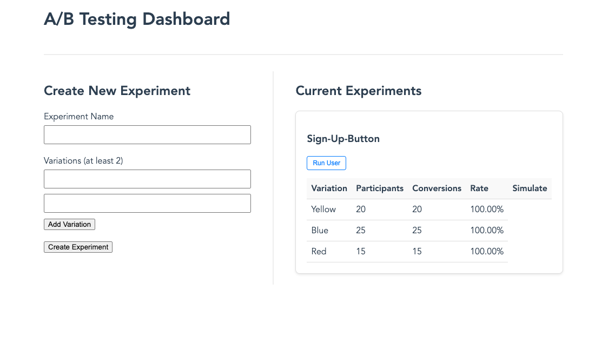
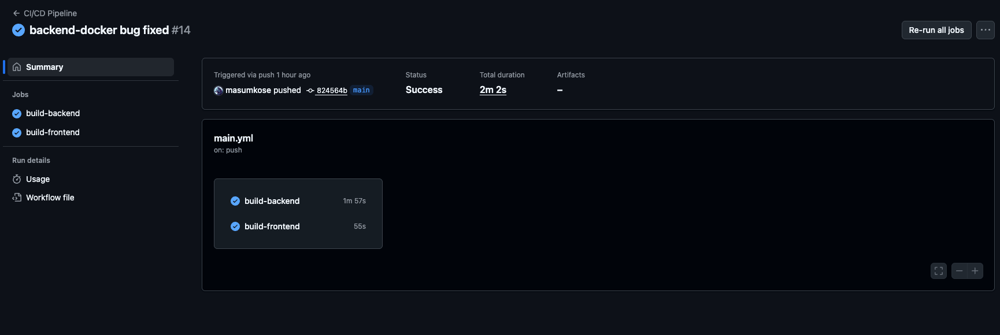

# A/B Testing Dashboard - Full-Stack Go & Vue.js Application


The application allows users to create experiments, define variations, and track key metrics like participant counts and conversions, providing a foundation for making data-driven product decisions.

---

## 📸 Screenshot



---

## ✨ Features

*   **Create Experiments:** A simple UI to define a new A/B test with a name and at least two variations.
*   **View Results:** A dashboard that lists all experiments and displays their variations in a clear table format.
*   **Track Key Metrics:** For each variation, the system tracks:
    *   **Participants:** The number of users assigned to that variation.
    *   **Conversions:** The number of users who completed the desired action.
    *   **Conversion Rate:** The calculated percentage of participants who converted.
*   **Realistic Simulation:** A "Simulate User Journey" feature that models real-world A/B testing by first assigning a user (incrementing participants) and then probabilistically determining if they convert.

---

## 🛠️ Tech Stack

This project was built using a modern, containerized architecture.

#### **Backend**
*   **Go (Golang):** For the high-performance, concurrent backend API.
*   **Gin Framework:** A lightweight and fast HTTP web framework for routing and handling requests.
*   **GORM:** The most popular ORM for Go, used for database interaction and migrations.
*   **PostgreSQL:** A powerful, open-source object-relational database system.

#### **Frontend**
*   **Vue.js (v3):** A progressive JavaScript framework for building the user interface, using the Composition API (`<script setup>`).
*   **Pinia:** The official, lightweight state management library for Vue.js.
*   **Axios:** For making HTTP requests from the frontend to the Go backend.
*   **Nginx:** A high-performance web server used to serve the static Vue.js application files.

#### **DevOps & Tooling**
*   **Docker & Docker Compose:** To containerize every part of the application (Go, Vue, Postgres) for a consistent and reproducible development environment.
*   **GitHub Actions:** For the complete CI/CD pipeline, which automatically:
    1.  Runs the backend unit tests on every push to `main`.
    2.  Builds production-ready Docker images for the backend and frontend.
    3.  Pushes the tagged images to Docker Hub.
*   **Makefile:** To provide simple, standardized shortcut commands for building, running, and managing the application.

---

## 📂 Project Structure

## The project is organized into a clean, scalable monorepo structure.
## .
## ├── .github/workflows/ # GitHub Actions CI/CD pipeline
## ├── backend/
## │ ├── handlers/ # HTTP request handlers (controllers)
## │ ├── models/ # GORM data models (structs)
## │ ├── database.go # Database connection logic
## │ ├── main.go # Main application entrypoint and router
## │ ├── main_test.go # Unit and integration tests
## │ └── Dockerfile # Multi-stage Docker build for the Go app
## ├── frontend/
## │ ├── src/
## │ │ ├── components/ # Reusable Vue components
## │ │ ├── services/ # API communication logic (axios)
## │ │ └── stores/ # Pinia state management
## │ ├── Dockerfile # Multi-stage Docker build for the Vue app
## │ └── nginx.conf # Nginx configuration for serving the SPA
## ├── docker-compose.yml # Defines and orchestrates all services
## ├── Makefile # Shortcut commands for development
## └── README.md # You are here!


---

## 🚀 Getting Started

### Prerequisites

*   Git
*   Docker
*   Docker Compose
*   Make (optional, but recommended for using shortcuts)

### Local Development

1.  **Clone the repository:**
    ```bash
    git clone https://github.com/YOUR_USERNAME/YOUR_REPO_NAME.git
    cd YOUR_REPO_NAME
    ```

2.  **Run the application:**
    The provided `Makefile` simplifies everything. This single command will build the Docker images and start all three services (database, backend, frontend) in the background.
    ```bash
    make up
    ```

3.  **Access the application:**
    *   **Frontend UI:** Open your browser to [http://localhost:8081](http://localhost:8081)
    *   **Backend API:** The API is accessible at `http://localhost:8080`

### Useful Makefile Commands

*   `make up`: Start all services.
*   `make down`: Stop and remove all services.
*   `make restart`: Restart all services.
*   `make logs`: View real-time logs from all services.
*   `make logs-backend`: View logs for the Go backend only.
*   `make test`: Run the backend unit tests.
*   `make clean`: Stop everything and **delete the database volume**.
*   `make help`: Display all available commands.

---
The backend has a suite of unit and integration tests that run against an in-memory SQLite database for speed and isolation.

To run the tests locally, use the Makefile shortcut:
```bash
make test

## 🧪 Running Tests


## 🔄 CI/CD Pipeline

* This project uses GitHub Actions for its CI/CD pipeline. The workflow is defined in .github/workflows/main.yml and is triggered on every push to the main branch.
* The pipeline performs the following steps:
* Checks out the code.
* Runs the Go unit tests to ensure code quality.
* Builds production Docker images for both the backend and frontend services.
* Pushes the images to a container registry (e.g., Docker Hub).


